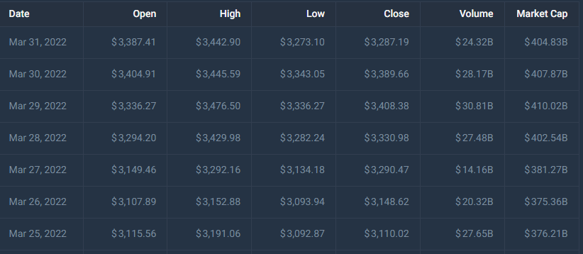

# Project-Machine

## Proposal
---
Due to their high volatility and multitude of influential variables, cryptocurrency prices have been notoriously hard to accurately predict. Since it is so difficult for humans to make these predictions, we are proposing an approach utilizing a series of machine learning models to determine whether or not we could profit from trading Ethereum (ETH). 

We will analyze ETH historical price data sourced from (https://coincodex.com/crypto/ethereum/historical-data/) in a series of datasets between 2013 and 2023 fitted to three different machine learning models in order to discern the model with the greatest predictive capacity for our price data. The three models we chose were a Support Vector Machine (SVM) model, a Long Short-Term Memory (LSTM) neural network, and a Prophet forecasting model. 

Prophet model problems during dev: it was tricky getting the model to predict accurately and we found that changes to the fitted timeframe greatly influenced the predictive outcomes, and that shorter timeframes resulted in far more precise predictions. 