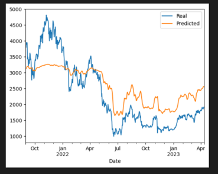
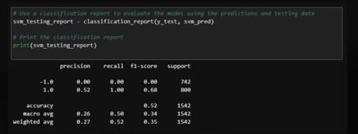

# Project-Machine
---

## Proposal
---
Due to their high volatility and multitude of influential variables, cryptocurrency prices have been notoriously hard to accurately predict. Since it is so difficult for humans to make these predictions, we are proposing an approach utilizing a series of machine learning models to determine whether or not we could profit from trading Ethereum (ETH). 

We will analyze ETH historical price data sourced from (https://coincodex.com/crypto/ethereum/historical-data/) between 2017 and 2021 fitted to three different machine learning models in order to discern the model with the greatest predictive capacity for our price data. The three models we chose were a Prophet forecasting model, a Support Vector Machine (SVM) model, and a Long Short-Term Memory (LSTM) neural network fitted using ETH financial data from the Yahoo Finance 'yfinance' module.

---
## Files

The `Eth Prices.ipynb`, `Eth_Prices_2.ipynb`, `LSTM Model.ipynb`/`RNN LSTM NN.ipynb`, files contain our analyses and processing of Ethereum historical price data and subsequent fitting to a Prophet forecast model, SVM model, and a LSTM neural network, respectively.
* [Prophet Model](Main/Eth%20Prices.ipynb)
* [Support Vector Model](Main/Eth_Prices_2.ipynb)
* [Long Short-Term Memory NN](LSTM%Model.ipynb)

The `eth_2017.csv` file contains Ethereum historical price data from 2017-2021.
* [ETH Historical Price Data](Main/eth_2017.csv)

---
## Prophet Forecasting Model
In this section, we had initially found it tricky getting the Prophet model to predict accurately. Ultimately, we realized that changes to the fitted timeframe greatly influenced the predictive outcomes, and that shorter timeframes resulted in far more precise predictions.

### Pre-Processing
To begin, clean the data and prepare it to be fitted to the Prophet forecasting model.
1. Read in the `eth_2017.csv` file as a DataFrame, indexing the `Date` column.
2. Drop unnecessary columns.
3. Use `hvPlot` to visualize the price data.
4. Reset the index and recode the columns for Prophet, using `ds` and `y` syntax.
5. Sort the DataFrame by `ds` in ascending order.

### Create a time series model using Prophet
1. Fit the DataFrame to a Prophet model.
2. Create a future DataFrame to hold predictions and use this trend data to make predictions.
3. Plot the Prophet forecast for the ETH price data.

4. Visualize the forecast results with the `plot_components` function.

---
## Support Vector Machine (SVM) Model

### Prepare the Data
1. Read in the `eth_2017.csv` file as a DataFrame, indexing the `Date` column.
2. Filter the `Date` index and `Close` columns.
3. Use `pct_change` to generate returns from close prices.
4. Set the long and short windows then generate `SMA_Fast` and `SMA_Slow`.
5. Create a Signal column
6. Calculate Strategy Returns

### Train the Data and Fit the Model
1. Select a training start and end date
2. Generate training DataFrames
3. Scale the Features
4. Make model predictions
5. Assemble a DataFrame of the predictions, actual returns, and strategy returns
6. Plot actual returns vs. strategy returns

7. Use a classification report to evaluate the model using the predictions and testing data

---
## LSTM Neural Network

### Prepare the Data
1. Define a window size
2. Initialize features and target column
3. Split the data
4. Create a `MiniMaxScaler` object and train the data
4. Reshape the features for the model

### Create the LSTM Model and Make Predictions
1. Define a LSTM `Sequential()` model and add Layer 1 as `model.add(LSTM(units=number_units, return_sequences=True, input_shape=(X_train.shape[1],1))` and `model.add(Dropout(dropout_fraction))` 
2. Add 2 more layers and an Output layer
3. Compile the model with `model.compile(loss='mse', optimizer='adam')`
4. Summarize the model
5. Train the model
6. Make predictions
7. Plot recommendations

8. Print evaluation metrics

---
## Conclusions
All three models are informative but each have their own flaws to consider before trading with real money. The Prophet forecasting model produced a tight fit to the data, but its future predictions could be deemed questionable. The SVM produced a profitable strategy but it is unclear how sustainable it would be in the longterm. The LSTM produced a respectable R^2, but it did not perform as well during periods of high volatility. Further tuning to our models, or adoption of different models in the future could potentially return better results with the data at hand. We could also look into comparing our LSTM neural network with another trading algorithm that could perform under higher levels of volatility. 